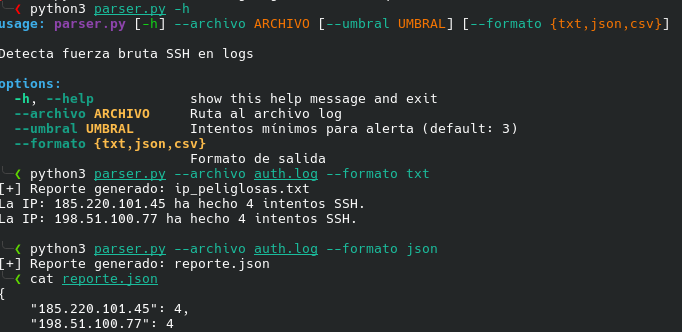

# SSH Brute-Force Detector & Log Parser

Herramienta (CLI) desarrollada en Python manualmente por mí para analizar logs de autenticación. Detecta de forma sencilla mediante expresiones regulares; IPs sospechosas y genera reportes (json, csv, txt) estructurados para integración en flujos de trabajo SOC/SysAdmin. 

##  Características
- **Detección Automatizada**: Utiliza `Regex` simple para extraer IPs de intentos fallidos SSH
- **Configurable**: Define umbrales de sospecha (ej. alerta si hay mas de 5 intentos)
- **Multi-formato**: Exporta resultados en:
  - `JSON`: Ideal para ingestión en SIEMs o APIs.
  - `CSV`: Compatible con Excel o hojas de cálculo.
  - `TXT`: Reporte legible para revisión rápida.
- **Dependencias típicas**: utiliza librerías estándar de python (`re`, `json`, `csv`, `argparse`)
- **Interfaz CLI**: Argumentos flexibles mediante `argparse`.

## Requisitos
- **Python 3.6+**
- **Archivo log Linux** (ej. /var/log/**auth.log** o simulado)
## Instalación

**Clona el repositorio**

```bash
git clone https://github.com/Pocee/ssh-bruteforce-detector
cd ssh-bruteforce-detector
```
_No requiere dependencias ya que utiliza las librerías estándar de Python 3.6+_

## Uso básico: (formato TXT por defecto)

```bash
python3 parser.py --archivo auth.log
```
#### Definir umbral de alerta (>10 intentos fallidos)
```bash
python parser.py --archivo auth.log --umbral 10
```
#### Exportar a JSON
```bash
python parser.py --archivo auth.log --formato json
# Genera: reporte.json
```
#### Exportar a CSV
```bash
python parser.py --archivo auth.log --formato csv
# Genera: reporte.csv
```
## Casos de uso
- Respuesta a incidentes: Identificar rápidamente IPs atacantes en logs de servidores
- Hardening de servers: Generar blacklists de IPs para después configurar reglas en iptables
## Ejemplo en mi terminal:




## Authors

- [@Pocee](https://www.github.com/Pocee)

Como parte de mi portfolio de automatización de sistemas y ciberseguridad